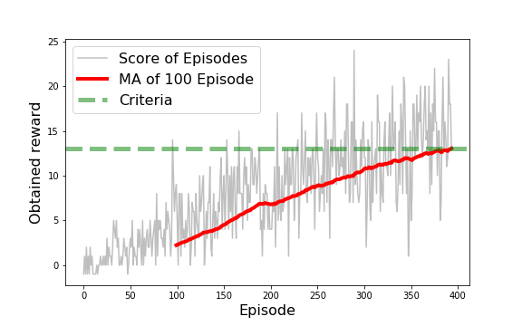

# REPORT 

The environment is based on Unity ML-agents

*Note:* The project environment provided by Udacity is similar to, but not identical to the Banana Collector environment on the Unity ML-Agents GitHub page.

Each time the agent collect a yellow banana, it’s given a reward of +1. For each blue banana, it received a -1 reward. The goal of the agent is to collect as many yellow bananas as possible and avoid any blue bananas, as it must increase the score given by the amount of rewards received.  

The state space has 37 dimensions and contains the agent's velocity, along with ray-based perception of objects around agent's forward direction.  Given this information, the agent has to learn how to best select actions.  4 discrete actions are available, corresponding to:

- **`0`** - move forward.
- **`1`** - move backward.
- **`2`** - turn left.
- **`3`** - turn right.

To complete the task the agent must get an average score of 13 over 100 consecutive episodes. 

This project implements a Value Based method named Deep Q-Networks, which combines two approaches: Q Learning (reinforcement learning method) and Q-table approximation learnt by a deep neural network.

### Neural network implementation
3 layers that include the input layer (37 dimensions), 1st hidden layer (64 dimensions), 2nd hidden layer (64 dimensions), 3rd output layer (4 dimensions representing each action). DNN was trained with Adam (Adaptive Moment Estimation). Agent training: Agent was trained with a maximum of 2000 episodes, or once the achieved score is equal or more than 16. Maximum number of steps per episode is 1000. Replay buffer included up to 100K records, and sampling was done randomly during updates. Hyper-parameter tuning: Epsilon decreases along the training steps from 1.0 down to 0.01 (with a decay of 0.995). As agents develops the strategy, we have less need of exploration and more exploitation to gain reward. Gamma is set to 0.99 and remains constant along the training. Alternative approach (as part of hyper-parameter tuning) would be to decrease Gamma along the training to shift agent’s preference from the long-term towards near-term reward.  
### Environment
Solved within 700 episodes (solved in 294 episodes: excellent result!)
### Hyperparameters
 - Replay Buffer Size: 100000 
 - Batch Size: 64 
 - Gamma (discount factor): 0.99 
 - Tau (soft update): 0.003 
 - Learning Rate: 0.0005 
 - Update Network: 4 

### Plot of Rewards

The code consist of :

    model.py : In this python file, a PyTorch QNetwork class is implemented. This is a regular fully connected Deep Neural Network using the PyTorch Framework. This network will be trained to predict the action to perform depending on the environment observed states. This Neural Network is used by the DQN agent and is composed of :
        the input layer which size depends of the state_size parameter passed in the constructor
        2 hidden fully connected layers of 1024 cells each
        the output layer which size depends of the action_size parameter passed in the constructor
    dqn_agent.py : In this python file, a DQN agent and a Replay Buffer memory used by the DQN agent) are defined.
        The DQN agent class is implemented, as described in the Deep Q-Learning algorithm. It provides several methods :
            constructor :
                Initialize the memory buffer (Replay Buffer)
                Initialize 2 instance of the Neural Network : the target network and the local network
            step() :
                Allows to store a step taken by the agent (state, action, reward, next_state, done) in the Replay Buffer/Memory
                Every 4 steps (and if their are enough samples available in the Replay Buffer), update the target network weights with the current weight values from the local network (That's part of the Fixed Q Targets technique)
            act() which returns actions for the given state as per current policy (Note : The action selection use an Epsilon-greedy selection so that to balance between exploration and exploitation for the Q Learning)
            learn() which update the Neural Network value parameters using given batch of experiences from the Replay Buffer.
            soft_update() is called by learn() to softly updates the value from the target Neural Network from the local network weights (That's part of the Fixed Q Targets technique)
        The ReplayBuffer class implements a fixed-size buffer to store experience tuples (state, action, reward, next_state, done)
            add() allows to add an experience step to the memory
            sample() allows to randomly sample a batch of experience steps for the learning
    DQN_Banana_Navigation.ipynb : This Jupyter notebooks allows to train the agent. More in details it allows to :
        Import the Necessary Packages
        Examine the State and Action Spaces
        Take Random Actions in the Environment (No display)
        Train an agent using DQN
        Plot the scores
